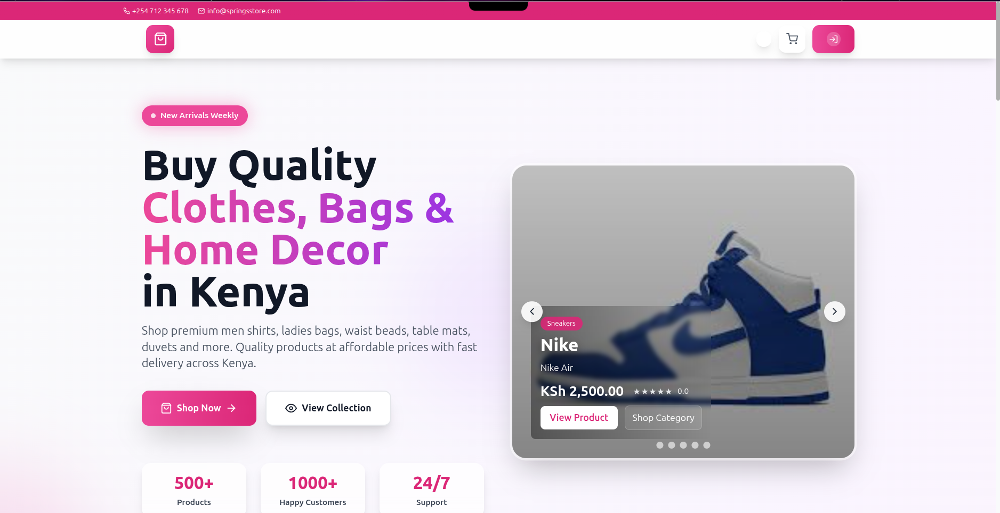
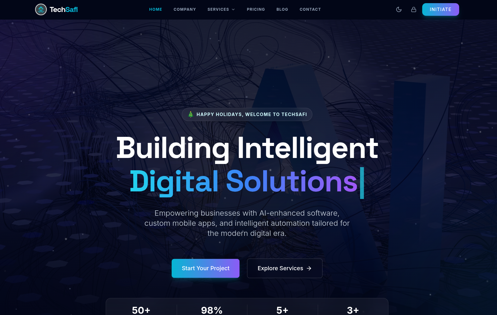
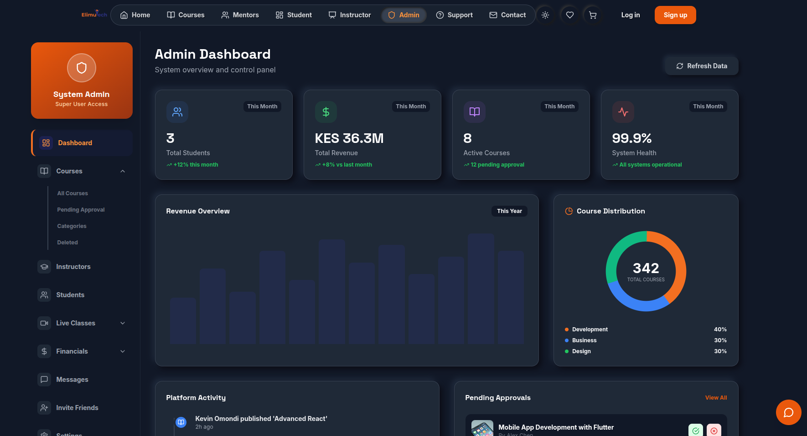
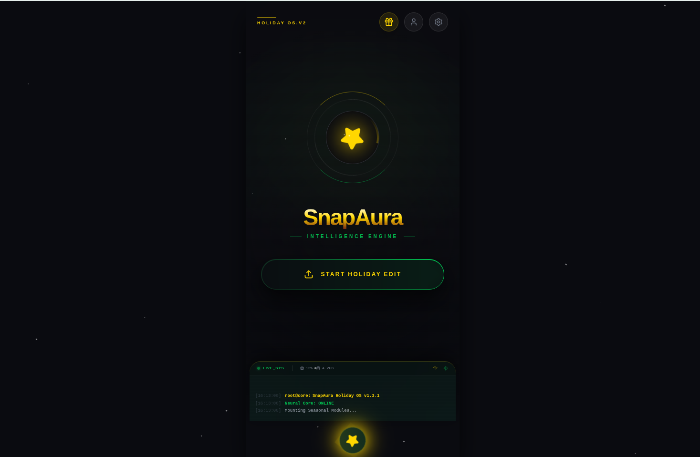
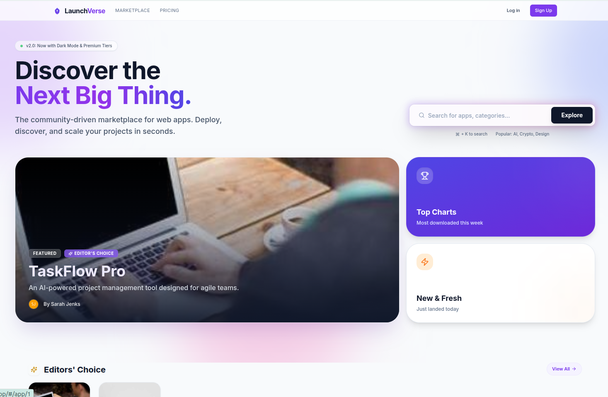
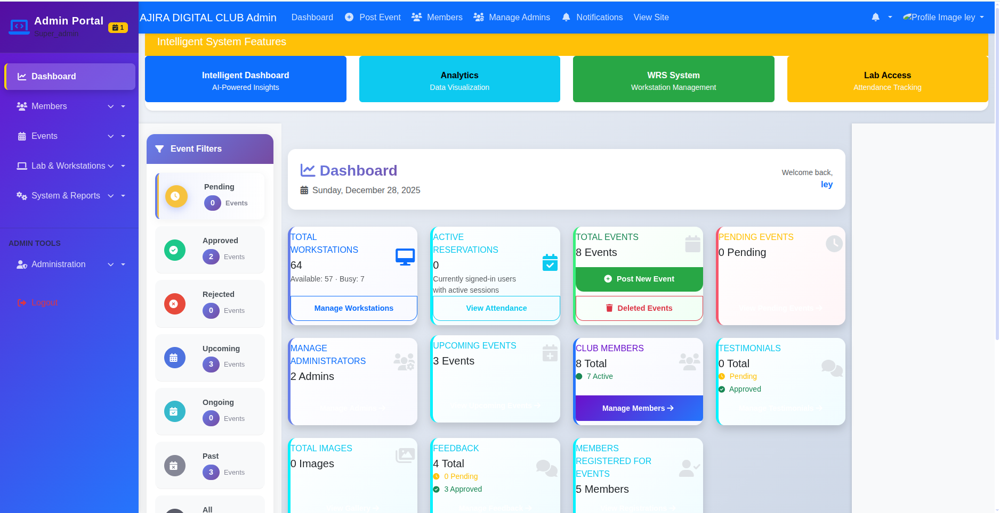

  
   
  

  
  
  

---

## 🚀 About Me

I'm a **Full-Stack Developer** and **Creative Graphic Designer** passionate about building innovative, user-centric solutions. My expertise spans web and app development, UI/UX design, AI integration, and system automation.

- 🌟 **Currently working on**: Elimu Tech LMS, SnapAura, LaunchVerse, and **TechSafi Website CMS**
- 🌱 **Learning & Exploring**: Next.js, Tailwind CSS, GraphQL, Advanced Android Development, AI Integrations
- 🏆 **Achievements**: Competitor in **TVET National WorldSkills Kenya**
- 💡 **Mission**: To create scalable, futuristic solutions for real-world problems
- 📬 **Contact**: [kennyleyy0@gmail.com](mailto:kennyleyy0@gmail.com)

---

## 💼 What I Offer

  <table>
    <tr>
      <td align="center"><b>📱 App Development</b> Native & Web Apps</td>
      <td align="center"><b>🌐 Full-Stack Web</b> End-to-End Solutions</td>
      <td align="center"><b>🎨 UI/UX Design</b> Figma & Prototyping</td>
      <td align="center"><b>🛠 SEO & Marketing</b> Boost Visibility</td>
      <td align="center"><b>📚 Git Coaching</b> Workflow Mastery</td>
    </tr>
  </table>

---

## 🔥 Featured Projects

  <table>
    <tr>
      <td align="center" width="33%">
        <a href="https://github.com/mastermind-creat/LaunchVerse">
          
           <b>E-Commerce Website</b>
        </a>
        
The community-driven E-Commerce Marketplace With backend and fully fucntional

      <td align="center" width="33%">
        <a href="https://github.com/mastermind-creat/new-kavirondo-sacco">
          
           <b>TechSafi Company Website</b>
        </a>
        
A complete dynamic website with CMS backend functionality

      </td>
      <td align="center" width="33%">
        <a href="https://github.com/mastermind-creat/lms">
          
           <b>Elimu Tech LMS</b>
        </a>
        
Dynamic Learning Management System for schools and institutions with advanced features.

      </td>
    </tr>
    <tr>
      <td align="center" width="33%">
        <a href="https://github.com/mastermind-creat/SnapAura">
          
           <b>SnapAura</b>
        </a>
        
A futuristic social media platform with AI companions and P2P chat.

      </td>
      <td align="center" width="33%">
        <a href="https://github.com/mastermind-creat/LaunchVerse">
          
           <b>LaunchVerse</b>
        </a>
        
An innovative platform for launching startups, showcasing portfolios, and connecting creators.

      </td>
      <td align="center" width="33%">
        <a href="https://github.com/mastermind-creat/Oxygen_Bus">
          
           <b>Ajira Digital club management system</b>
        </a>
        
End-to-end solution for Club Management, Workstation booking and Lab Access enabled

      </td>
    </tr>
  </table>

---

## 🧰 Tech Stack

  
  
  
  
  
  
  
  
  
  
  
  
  

---

## 🐍 GitHub Contribution Snake

  

---

## 📊 GitHub Stats

  
  
  

  

  

---

## 🌟 Latest Updates

- 🎉 **Lines Genius App** launched with dynamic code generation and EmailJS-powered subscriptions
- 🛠 Working on **Next.js-powered portfolio** with advanced animations, dark mode, and futuristic UI
- 📚 Mentoring developers on Git workflows and open-source contributions
- 🚀 Developing **Elimu Tech LMS, SnapAura, LaunchVerse**

---

## 🌐 Connect with Me

  
  
  

---

  <b>“Code is the canvas of innovation – let’s paint the future together.”</b> 
  ⭐️ Thanks for visiting! Let’s collaborate on something extraordinary.

