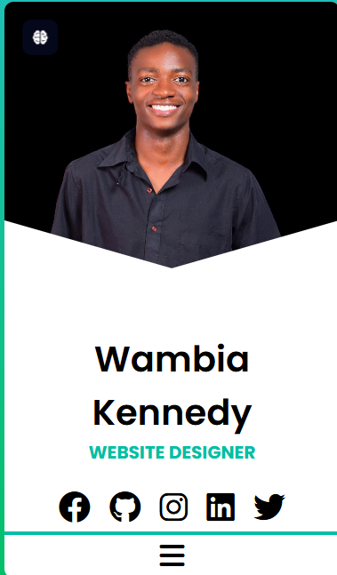

<h1 align="center">Hi 👋, I'm Wambia Kennedy</h1>
<h3 align="center">A Passionate Full-Stack Web & App Developer | Creative Graphic Designer</h3>

  

---

## 🚀 About Me

- 👨‍💻 Currently focused on:
  - **Library Management Systems**
  - **Bursary Automation Projects**
  - **Hyper-Localized Service Platforms**
  - **Lines Genius App Development**
- 🌱 Exploring: React, Next.js, Android Development, EmailJS Integration
- 🧠 Passionate about crafting innovative solutions with code and design
- 🏆 Competitor: **TVET National WorldSkills Kenya Competition**
- ✉️ Reach me: [kennyleyy0@gmail.com](mailto:kennyleyy0@gmail.com)

---

## 💼 Services I Offer

- 📱 App Development (Android, Web-based)
- 🌐 Full-Stack Web Development
- 🎨 Logo & UI/UX Design (Figma)
- 🛠 SEO & Digital Marketing
- 📦 Git & GitHub Workflow Coaching

---

## 📢 Latest Update
🎉 Just launched the **Lines Genius App** – a creative coding platform with subscription features!  
Features include:
- Dynamic code generation
- Email subscription system with EmailJS
- Engaging UI with Framer Motion animations  
📁 [Explore Lines Genius](https://github.com/Lines-Genius/Lines-Genius)  

---

  

  Lines Genius is a cutting-edge app blending programming, creativity, and humor. Built with modern tech, it offers: 
  - Real-time code generation 
  - Subscription-based content delivery 
  - Interactive animations and dark mode support 
  <a href="https://github.com/Lines-Genius/Lines-Genius" target="_blank">View Repository</a>

---

  

  <b>New Kavirondo SACCO Management System</b> is a robust platform designed for efficient SACCO operations. Key features include: 
  - Member registration and management 
  - Loan processing and tracking 
  - Automated savings and reporting 
  - Secure role-based access 
  <a href="https://github.com/mastermind-creat/new-kavirondo-sacco" target="_blank">View Repository</a>

---

## 🧰 Tech Stack

  
  
  
  
  
  
  
  
  
  
  
  
  
  
  
  

---

## 🏆 Featured Projects

<table align="center">
  <tr>
    <td align="center" width="320">
      <a href="https://github.com/Lines-Genius/Lines-Genius">
        
         
        <b>Lines Genius App</b>
      </a>
      

        A creative coding platform with dynamic generation, subscriptions, and animations.
      

    </td>
    <td align="center" width="320">
      <a href="https://github.com/mastermind-creat/motorbike-leasing-system">
        
         
        <b>Motorbike Leasing System</b>
      </a>
      

        A PHP/MySQL-based system for motorbike leasing with role-based access.
      

    </td>
    <td align="center" width="320">
      <a href="https://github.com/mastermind-creat/Oxygen_Bus">
        
         
        <b>Bus Booking Management System</b>
      </a>
      

        An end-to-end solution for bus ticketing and schedule management.
      

    </td>
  </tr>
</table>

---

## 📈 GitHub Stats & Contributions

  
  

---

## 🌐 Portfolio

  Check out my latest work and projects at:  
  

---

## 🌐 Connect with Me

  
  
  

---

  <b>“Code is the language of innovation – let’s build the future together.”</b>

  ⭐️ Thanks for stopping by! Let’s create something amazing.

