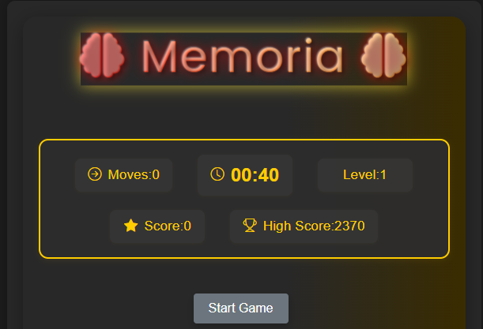

  <!-- THE SUPREME WIZARD HEADER -->
  
  
   

  

  

    
  

  

    
    
    
  

---

## 📜 The Chronicles of Mastermind (About Me)

I am a **Creative Systems Architect** and **Full-Stack Wizard** who crafts high-performance digital artifacts. I believe code is not just instructions—it's a medium for innovation and transformation.

  <table border="0">
    <tr>
      <td width="300" align="center">
        
      </td>
      <td width="500">
        
<b>📍 Sanctuary:</b> Kisumu, Kenya 🇰🇪

        
<b>🎓 Arcane Knowledge:</b> Programming (Seme TVC)

        
<b>🗣️ Tongues:</b> English, Swahili, JavaScript, Python

        
<b>🧠 Philosophy:</b> "Logic is my spellbook, Code is my wand."

        
<b>😂 Fun Fact:</b> I debug code faster than I can solve a Rubik's cube!

      </td>
    </tr>
  </table>

---

## 🏛️ The Great Halls of Offering (Services)

  <table border="0">
    <tr>
      <td align="center"><b>📱 App Wizardry</b> Native & Web Apps</td>
      <td align="center"><b>🌐 Web Alchemy</b> End-to-End Systems</td>
      <td align="center"><b>🎨 Illusion Design</b> Premium UI/UX</td>
    </tr>
    <tr>
      <td align="center"><b>⚡ Performance Spells</b> SEO & Optimization</td>
      <td align="center"><b>📜 Git Mentorship</b> Workflow Mastery</td>
      <td align="center"><b>🤖 AI Integration</b> Intelligent Systems</td>
    </tr>
  </table>

---

## 🏰 Ancient Artifacts (Featured Projects)

  <table border="0">
    <tr>
      <td align="center" width="50%">
        
         <b>🌟 Lines Genius App</b>
         <i>Real-time AI code generation with framer-motion magic.</i>
         <a href="https://lines-genius.vercel.app/">[Invoke Spell]</a>
      </td>
      <td align="center" width="50%">
        
         <b>💰 Kavirondo SACCO</b>
         <i>Member registration, loan tracking, and secure financial vaults.</i>
         <a href="https://github.com/mastermind-creat/new-kavirondo-sacco">[View Scrolls]</a>
      </td>
    </tr>
    <tr>
      <td align="center" width="50%">
        
         <b>🚌 Bus Booking System</b>
         <i>End-to-end ticketing and schedule management system.</i>
         <a href="https://github.com/mastermind-creat/Oxygen_Bus">[View Scrolls]</a>
      </td>
      <td align="center" width="50%">
        
         <b>🧠 Memory Game Web App</b>
         <i>Challenging neural training app built with React.</i>
         <a href="https://memory-game-two-sable.vercel.app/">[Test Reality]</a>
      </td>
    </tr>
  </table>

---

## 🎭 The Gallery of Illusions (Graphic Designs)

  <table border="0">
    <tr>
      <td align="center" width="33%">
        
         <b>Flyer Design</b>
      </td>
      <td align="center" width="33%">
        
         <b>Startup Identity</b>
      </td>
      <td align="center" width="33%">
        
         <b>Ajira Training</b>
      </td>
    </tr>
  </table>

---

## 🛡️ The Arsenal of Knowledge (Tech Stack)

  
  
  
  
  
  
  
  
  
  
  

---

## 🐍 Evolution Ritual (Contribution Snake)

  

---

## 📊 Arcane Analytics

  
  
   
  
  

---

## 🌌 Communion (Connect With Me)

  
  &nbsp;
  
  &nbsp;
  
  &nbsp;
  

---

   
  <b>🚀 “Code is the painting of the digital future.”</b> 
  ⭐️ <i>Liked my work? Leave a star on my repositories!</i>

