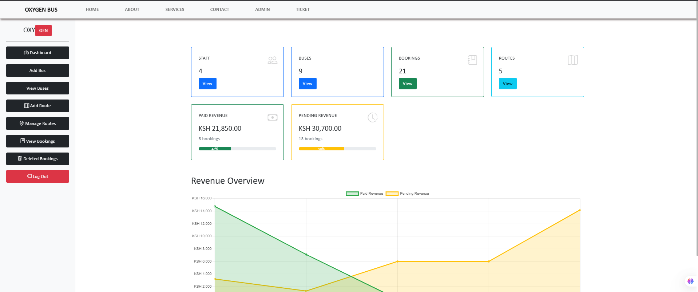

<h1 align="center">Hi 👋, I'm Wambia Kennedy</h1>
<h3 align="center">A Passionate Full-Stack Web Developer | App Developer | Graphic Designer</h3>

  

---

## 🚀 About Me

- 👨‍💻 Currently focused on:
  - **Library Management Systems**
  - **Bursary Automation Projects**
  - **Hyper-Localized Service Platforms**
- 🌱 Learning: React, Android Development, Next.js
- 🧠 Passionate about solving real-world problems through code
- 🏆 Competitor: **TVET National WorldSkills Kenya Competition**
- ✉️ Contact: [kennyleyy0@gmail.com](mailto:kennyleyy0@gmail.com)

---

## 💼 Services I Offer

- 📱 App Development (Android, Web-based)
- 🌐 Website Design & Development
- 🎨 Logo & UI/UX Design (Figma)
- 🛠 SEO & Digital Marketing
- 📦 Version Control (Git & GitHub Coaching)

---

## 📢 Latest Update
🎉 Just completed my **Motorbike Leasing System** using PHP and MySQL.  
Features include:
- Customer and Admin roles
- Idle/Busy status updates
- Late fee logic (Ksh 50/hour)  
📁 [Check the project here](https://github.com/mastermind-creat/motorbike-leasing-system)

---
## 🧰 Tech Stack

  
  
  
  
  
  
  
  
  
  

---

## 🏆 Featured Projects

<table align="center">
  <tr>
    <td align="center" width="320">
      <a href="https://github.com/yourusername/project1">
        
         
        <b>Ajira Digital Management System</b>
      </a>
      

        A platform for managing digital skills training, user onboarding, and project tracking.
      

    </td>
    <td align="center" width="320">
      <a href="https://github.com/mastermind-creat/Oxygen_Bus">
        
         
        <b>Bus Booking Management System</b>
      </a>
      

        An end-to-end solution for bus ticketing, seat reservation, and schedule management.
      

    </td>
    <td align="center" width="320">
      <a href="https://github.com/yourusername/project3">
        
         
        <b>Library Store Management System</b>
      </a>
      

        A comprehensive system for managing library inventory, lending, and user accounts.
      

    </td>
  </tr>
</table>
  </a>

<!--
  Replace the image URLs and links above with your actual project images and repository links.
  You can add or remove projects as needed.
-->

---

## 📈 GitHub Stats

  
  

---

## 🌐 Connect with Me

  
  
  

---

  <b>“Code is not just syntax – it's how we speak to the world.”</b>

  ⭐️ Thanks for visiting my profile!

