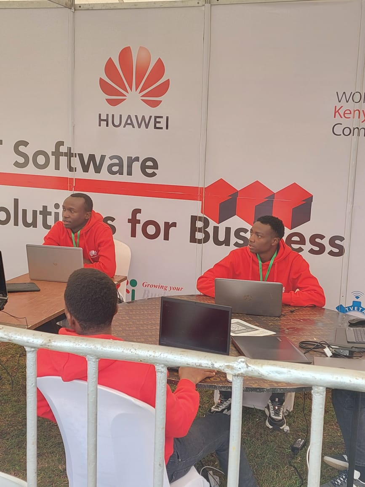

<!-- Animated Header Banner -->


<div align="center">

<!-- Hero Section -->
<h1>
  <a href="https://git.io/typing-svg">
    
  </a>
</h1>

<!-- Subtitle -->
<h3>
  
</h3>

<!-- Profile Stats with Animations -->
<p align="center">
  <a href="https://github.com/mastermind-creat?tab=followers">
    
  </a>
  
  
</p>

<!-- Social Badges with GIF Integration -->
<p align="center">
  <a href="https://www.linkedin.com/in/mastermind-5799bb398">
    
  </a>
  <a href="mailto:kennyleyy0@gmail.com">
    
  </a>
  <a href="https://lates-portfolio-v1.vercel.app/">
    
  </a>
  <a href="https://x.com/MastermindCreat">
    
  </a>
  <a href="https://www.instagram.com/mastermindcreat/">
    
  </a>
  <a href="https://www.youtube.com/@kennyleyy3918">
    
  </a>
  <a href="https://web.facebook.com/profile.php?id=100073953339674">
    
  </a>
  <a href="tel:+254743394373">
    
  </a>
</p>

<!-- Tech Stack with Categories -->
</details>

<br/>

**💪 Technical Proficiency**

<div align="left">

**Architecture & Systems Engineering**


**Backend Mastery**


**Frontend Excellence**


</div>

<br/>

</div>

<!-- Another Divider -->


## 🧠  Philosophy & Value Proposition

<div align="center">

```typescript
interface Engineer {
  mindset: "Systems Thinker" | "Feature Builder";
  approach: "Architecture-First" | "Quick-Fix";
  impact: "Compounding Value" | "Temporary Solutions";
}

const wambiaKennedy: Engineer = {
  mindset: "Systems Thinker",
  approach: "Architecture-First", 
  impact: "Compounding Value"
};
// "I don't build features; I architect resilient, intelligent systems that scale, adapt, and deliver compounding value."
```

</div>

I am a Systems Engineer at heart, translating complex real-world challenges in education, NGOs, and service marketplaces into elegant, automated, and scalable digital solutions. My work sits at the intersection of robust backend engineering, intelligent automation, and intuitive product design.

<table> <tr> <td width="25%" align="center">
🔄 Systems Thinking
Architecting interconnected modules, not monolithic apps. Every component is designed for evolution.

</td> <td width="25%" align="center">
⚙️ Automation-First
Identifying and eliminating manual toil through custom workflows (n8n, bots, APIs).

</td> <td width="25%" align="center">
📈 Impact-Driven
Prioritizing projects that create tangible social or operational value, measured by real metrics.

</td> <td width="25%" align="center">
🛡️ Engineering Rigor
Writing maintainable, documented code with clean architecture and scalable data models.

</td> </tr> </table>

---

## 🏆 Featured Architecture Projects

**Elite systems that demonstrate mastery of full-stack engineering, automation, and product thinking**

<div align="center">

<table> 
<tr> 
<td width="50%" valign="top"> 

<div align="center">

<!-- Project Screenshot -->
<a href="https://github.com/mastermind-creat/elimu-tech-lms">
  
</a>

<br/>

 

### <a href="https://github.com/mastermind-creat/elimu-tech-lms">A Scalable Learning Ecosystem</a>

</div>

Full-stack LMS digitizing education for institutions. Features modular course builders, automated assessment engines, and analytics dashboards.

**Architecture Highlights:**

- ✅ Multi-tenant SaaS architecture
- ✅ Real-time progress tracking
- ✅ Automated grading & certification
- ✅ RESTful API with JWT authentication

<p align="center"> 
   
</p>

<p align="center">
  <a href="https://github.com/mastermind-creat/elimu-tech-lms">
    
  </a>
</p>

</td> 

<td width="50%" valign="top"> 

<div align="center">

<!-- Project Screenshot -->
<a href="https://github.com/mastermind-creat/snapaura">
  
</a>

<br/>

 

### <a href="https://github.com/mastermind-creat/snapaura">Intelligent Content Delivery Platform</a>

</div>

High-performance platform for dynamic media and content, built with smart caching, responsive UI patterns, and a decoupled architecture.

**Technical Innovations:**

- ✅ Lazy-loading & progressive enhancement
- ✅ CDN-optimized asset delivery
- ✅ Component-based design system
- ✅ API-first architecture

<p align="center"> 
   
</p>

<p align="center">
  <a href="https://github.com/mastermind-creat/snapaura">
    
  </a>
</p>

</td> 
</tr> 

<tr> 
<td width="50%" valign="top"> 

<div align="center">

<!-- Project Screenshot -->
<a href="https://github.com/mastermind-creat/pageforge">
  
</a>

<br/>

 

### <a href="https://github.com/mastermind-creat/pageforge">Rapid Landing Page System</a>

</div>

Developer-friendly page builder emphasizing performance and design consistency. Enables rapid deployment of SEO-optimized landing pages.

**System Features:**

- ✅ Component library with pre-built blocks
- ✅ Zero-config deployment pipeline
- ✅ Built-in SEO & performance optimization
- ✅ Version control for design iterations

<p align="center"> 
   
</p>

<p align="center">
  <a href="https://github.com/mastermind-creat/pageforge">
    
  </a>
</p>

</td> 

<td width="50%" valign="top"> 

<div align="center">

<!-- Project Screenshot -->
<a href="https://github.com/mastermind-creat/launchverse">
  
</a>

<br/>

 

### <a href="https://github.com/mastermind-creat/launchverse">Product Launch Orchestrator</a>

</div>

An integrated platform to manage product launches from waitlist and hype-building to post-launch analytics and community engagement.

**Orchestration Capabilities:**

- ✅ Multi-channel campaign automation
- ✅ Real-time analytics dashboard
- ✅ Community engagement tools
- ✅ A/B testing framework

<p align="center"> 
   
</p> 

<p align="center">
  <a href="https://github.com/mastermind-creat/launchverse">
    
  </a>
</p>

</td> 
</tr> 
</table>

</div>

---

<!-- ## 🎨 Digital Art & UI/UX Gallery

**Visual excellence in product design, branding, and graphic communication** -->

<!-- <div align="center">

<table>
<tr>
<td width="33%">

<p align="center"><b>Branding & Identity</b></p>
</td>
<td width="33%">

<p align="center"><b>Digital Illustration</b></p>
</td>
<td width="33%">

<p align="center"><b>UI/UX Concepts</b></p>
</td>
</tr>
<tr>
<td width="33%">

<p align="center"><b>Web Portals</b></p>
</td>
<td width="33%">

<p align="center"><b>Community Systems</b></p>
</td>
<td width="33%">

<p align="center"><b>Mobile Experiences</b></p>
</td>
</tr>
</table>

</div> -->

---

## 🔗 Other Impactful Systems

<details> 
<summary><b>Click to expand complete project portfolio</b></summary>

| Project | Purpose | Tech Stack | Impact Metric |
|---------|---------|------------|---------------|
| Ajira Digital Club System | Membership & event management for tech communities | Laravel, MySQL | 500+ active members |
| NGO Bursary Management | Transparent fund allocation with applicant tracking | PHP, PostgreSQL | $100K+ distributed |
| Student Result Management | Academic tracking with automated report generation | Laravel, React | 2000+ students |
| WhatsApp Automation Bots | Intelligent customer support & engagement workflows | Python, Twilio API | 90% response automation |
| Memoria | Browser-based cognitive training game | JavaScript, LocalStorage | 5K+ gameplay sessions |

</details>

---

## 🛠️ Technology Radar 

**A curated stack chosen for specific strengths in building reliable, scalable systems**

<div align="center">


</div>

<div align="center"> 

**🗃️ Data Layer | 🚀 DevOps & Infrastructure | 📊 Analytics** 

<br/>

 

</div>

---

## 📈 GitHub Systems Analytics 

<div align="center">

<!-- Contribution Snake Animation -->
<picture>
  <source media="(prefers-color-scheme: dark)" srcset="https://raw.githubusercontent.com/mastermind-creat/mastermind-creat/output/github-contribution-grid-snake-dark.svg">
  <source media="(prefers-color-scheme: light)" srcset="https://raw.githubusercontent.com/mastermind-creat/mastermind-creat/output/github-contribution-grid-snake.svg">
  
</picture>

<br/>
<br/>

<!-- Enhanced Profile Summary -->


<br/>

<!-- Stats Cards -->
<a href="https://github.com/mastermind-creat"> 
   
</a> 
<a href="https://github.com/mastermind-creat"> 
   
</a>

<br/>
<br/>

<!-- Enhanced Streak Stats -->
<a href="https://git.io/streak-stats"> 
   
</a>

<br/>
<br/>

<!-- Trophies -->


</div>

---

## 🧭 Strategic Engineering Roadmap (2026+)

**My current engineering and research vector focuses on intelligent, autonomous systems**

<div align="center">


</div>

---

## 📍 Current Active Priorities


<table> 
<tr> 
<td width="50%">

**🎯 Technical Mastery**

- Advanced React patterns (Suspense, Concurrent)
- LLM integration & prompt engineering
- Microservices with event-driven architecture
- Performance optimization at scale

</td> 
<td width="50%">

**🌍 Impact Initiatives**

- Personal AI assistant ecosystem
- Education platform expansion (Elimu Tech)
- NGO digital transformation toolkit
- Open-source automation frameworks

</td> </tr> </table>

---

## � Accomplishments & Digital Badges

<div align="center">


</div>

---

## �🌐 The MASTERMINDCREAT Ethos

<div align="center">


<br/>
<br/>

**MASTERMINDCREAT is more than a brand; it's a build philosophy.**

It represents the commitment to creating digital ecosystems that are:

- **Intelligent by Design** → AI-first thinking
- **Scalable by Architecture** → Built for growth
- **Valuable by Impact** → Measured results

<br/>

Every line of code serves the larger vision of a more automated, efficient, and human-centric world.

</div>

---

## 💬 Testimonials & Recommendations

<div align="center">

<table>
<tr>
<td width="50%" align="center">


<br/>
<br/>

> *"Wambia's systems thinking approach transformed our entire platform architecture. His ability to see the big picture while managing intricate details is exceptional."*

**— Education Institution Director**

</td>
<td width="50%" align="center">


<br/>
<br/>

> *"One of the most innovative engineers I've worked with. He doesn't just build features—he architects solutions that scale and evolve."*

**— Senior Full-Stack Developer**

</td>
</tr>
<tr>
<td width="50%" align="center">


<br/>
<br/>

> *"The automation workflows Wambia built saved our team 20+ hours per week. His work directly impacted our bottom line."*

**— NGO Operations Manager**

</td>
<td width="50%" align="center">


<br/>
<br/>

> *"Clean code, excellent documentation, and a genuine passion for solving real problems. A true systems engineer."*

**— Tech Lead, Startup**

</td>
</tr>
</table>

</div>


---

## 🎯 Current System Status

<div align="center">

```typescript
const MASTERMIND_STATE = {
  🔭 activeProject: "AI-Driven SaaS Ecosystem",
  🌱 researchPhase: "Distributed Microservices & LLM Orchestration",
  💬 consulting: "NGO Digital Transformation & LMS Strategy",
  ⚡ efficiency: "Automating 90% of repeatable digital workflows",
  🚀 focus: "Scaling impact-first digital solutions globally"
};
```

</div>

---

## 💬 Let's Architect the Future

<div align="center">

I am actively seeking collaborations, advisory roles, and challenging problems that sit at the intersection of systems engineering, automation, and social impact.

<br/>
<br/>

**Let's build systems that matter.**

<br/>

<a href="mailto:kennyleyy0@gmail.com">  </a> 
<a href="https://www.linkedin.com/in/mastermind-5799bb398">  </a> 
<a href="https://lates-portfolio-v1.vercel.app/">  </a>


---

## 🌍 Global Visitor Footprint

<div align="center">


<br/>

[](https://geovisit.io)

</div>

<br/>

<sub>Crafted with precision for systems that scale. </sub>

</div><!-- Wave Animation Footer -->